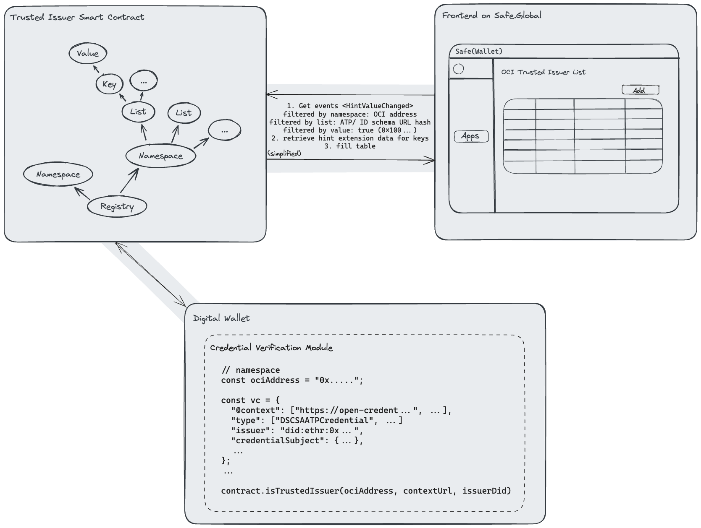

<div align="center">
    
    
</div>

<div align="center">

[](https://open-credentialing-initiative.github.io/Digital-Wallet-Conformance-Criteria/latest/)
[](https://GitHub.com/Open-Credentialing-Initiative/trusted-issuer-registry/graphs/contributors/)
[](https://GitHub.com/Open-Credentialing-Initiative/trusted-issuer-registry/issues/)
[](https://GitHub.com/Open-Credentialing-Initiative/trusted-issuer-registry/pull/)

</div>

---

## OCI Trusted Issuer Registry

This repository contains a smart contract for a registry of trusted hints used in decentralized ecosystems based on
ERC-7506. It provides a standardized on-chain metadata management system aiding in verification of on- and off-chain
data, like Verifiable Credentials. OCI leverages this standard to provide a registry of trusted issuers with minor
ecosystem-specific additions to the standard.

## Introduction

In a trusted and regulated ecosystem, a list of trusted issuing parties is needed. For this purpose, the OCI defined a
secure, always-available, and self-governing mechanism to manage and retrieve a list of trusted Decentralized
Identifiers (DIDs) belonging to trusted issuers. These trusted issuers can be granularly defined on a credential
type level.

For this purpose, an open, trustless, and decentralized network that is able to run arbitrary programs was chosen: The
Ethereum network. The programs you can run on it are called "Smart Contracts". Those are self-contained programs that
can store and manipulate their state.

This repository contains code and documentation for a trusted issuer registry smart contract.

## Goals

The chosen approach aims to enforce the following policies:

- Always available: Calling the trusted issuer list is an integral part while verifying ATP or identity credentials, so
  it should be always available.
- Trustless: The architecture and the execution of the trusted issuer registry should not be owned and controlled by a
  single entity.
- Transparent: The code, state, and executions of the trusted issuer registry should be transparent to all parties in
  the ecosystem.
- Auditability: It should be possible to retrieve a previous state of the trusted issuer registry.
- Security: Changes to the trusted issuer registry should only be made by trusted entities.

## Architecture

The trusted issuer registry smart contract is based on the [ERC-7506](https://eips.ethereum.org/EIPS/eip-7506) standard
and extends it with additional functionality. It contains a data structure to keep track of trusted issuer statuses and
a set of functions to manage them.

Data inside the registry is organized in an unlimited number of namespaces. Each namespace is owned by a unique
Ethereum address that has the sole write access to lists organized in this namespace. In the OCI ecosystem, each
list corresponds to a versioned credential type, e.g. ATP or identity credentials. They are identified by the keccak256
hash of the json-ld context url of the credential type. In those lists, key value pairs of DIDs and their status are 
stored. The key is the keccak256 hash of the DID and the value is bytes32 representation of the status boolean. The
status is true if the DID is a trusted issuer and false otherwise.

The namespace of the OCI is the address of a shared wallet that is controlled by the individual hardware wallets of the
OCI statekeepers. The statekeepers can propose changes to the trusted issuer registry to the shared wallet. Other
statkeepers can approve or reject the proposal inside the shared wallet with their individual hardware wallets. If the 
proposal is approved by a majority of the statekeepers, the proposed transaction is executed by the shared wallet. This
architecture ensures that only trusted entities can change the state of the trusted issuer registry. 
[Safe.Global](https://safe.global/) is used as the shared wallet for the OCI trusted issuer registry.

The following diagram shows the system architecture of the trusted issuer registry and how it is being consumed by
a frontend application and digital wallet providers.



## Deployments

The trusted issuer registry smart contract is deployed to the Ethereum blockchain. The following table contains all
deployments of the smart contract and their intended use cases.

| Environment | Network | Contract Address                                                                                                              | Namespace                                                                                                                     | Use Case                                                                                                                            |
|-------------|---------|-------------------------------------------------------------------------------------------------------------------------------|-------------------------------------------------------------------------------------------------------------------------------|-------------------------------------------------------------------------------------------------------------------------------------|
| PRD         | Mainnet | TBD                                                                                                                           | TBD                                                                                                                           | Production deployment                                                                                                               |
| STK-INT     | Sepolia | [0xaFec50dd5D3599377C74CEEde4fc54C400D28909](https://sepolia.etherscan.io/address/0xaFec50dd5D3599377C74CEEde4fc54C400D28909) | [0xb229AC3bC15bacCe74A721a722d8098178c22353](https://sepolia.etherscan.io/address/0xb229AC3bC15bacCe74A721a722d8098178c22353) | Development - Integration testing for OCI Statekeepers. Only approved OCI Statekeepers can add/ remove trusted issuer DIDs.         |
| WLT-INT     | Sepolia | [0x1fD876182E3ca7Aa208cF66e659666dc1d372e5C](https://sepolia.etherscan.io/address/0x1fD876182E3ca7Aa208cF66e659666dc1d372e5C) | [0x6c151A6139c40966029B9ce8e7b24a4D61215921](https://sepolia.etherscan.io/address/0x6c151A6139c40966029B9ce8e7b24a4D61215921) | Development - Integration testing for OCI wallet providers. Only approved OCI wallet providers can add/ remove trusted issuer DIDs. |
| PBL-INT     | Sepolia | [0x23307e987aa5e4a4ff7dc2dc4bcea8eed092f5a4](https://sepolia.etherscan.io/address/0x23307e987aa5e4a4ff7dc2dc4bcea8eed092f5a4) | Developers MetaMask wallet address                                                                                            | Development - Open integration playground without any governance. Anyone can add/ remove trusted issuer DIDs.                       |

Make sure to use the appropriate environment for your testing purposes. Access to the governed environments can be
requested in the issues section of this repository.

## Usage & Integration

To integrate the trusted issuer registry into your application, you can use many of the available web3 libraries for
various programming languages. Those include:

- [Ethers](https://docs.ethers.org/v5/) or [web3.js](https://web3js.readthedocs.io/en/v1.10.0/) for JavaScript
- [Web3j](https://docs.web3j.io/) for Java
- [web3.py](https://web3py.readthedocs.io/en/stable/) for Python
- [Nethereum](https://docs.nethereum.com/en/latest/) for .NET
- [web3](https://docs.rs/web3/latest/web3/) for Rust

To communicate with the Ethereum blockchain and the trusted issuer registry contract on it, you need the following
things:

- A connection to an Ethereum node or a hosted service like [Infura](https://infura.io/) (recommended for development
  purposes)
- The contract ABI (Application Binary Interface) that describes the contract's functions and events
- The contract address on the Ethereum (test) network

If you also intend to modify the state of the contract, e.g. adding a trusted issuer DID, you additionally need a
*funded* Ethereum account that is allowed to modify the contract state. Only statekeeper are allowed to change the
contract state on **STK-INT** and **WLT-INT**. On **PBL-INT**, any funded address can modify the contract state. To fund
your
Ethereum address, you need to send ETH to an address you control. For the Sepolia test network, you can use so-called
faucets to get free testnet ETH. This is a list of well-known faucets:

- https://sepolia-faucet.pk910.de/
- https://sepoliafaucet.com/
- https://www.infura.io/faucet/sepolia

**Reading the contract state, e.g. for checking if a DID is a trusted issuer, is free and does not require an Ethereum
account.** The following code snippet demonstrates how to read the contract state using the Ethers library for
JavaScript:

```javascript
const {ethers} = require("ethers");
const CONTRACT_ADDRESS_SEPOLIA_STK = '...';
const CONTRACT_NAMESPACE_SEPOLIA_WLT = '...';
const CONTRACT_ABI = [...];

(async () => {
  const provider = new ethers.providers.InfuraProvider(
    "sepolia",
    "INFURA_API_KEY
  );
  const contract = new ethers.Contract(CONTRACT_ADDRESS_SEPOLIA_WLT, CONTRACT_ABI, provider);

  // Check for a single DID
  const schemaUrl = "https://open-credentialing-initiative.github.io/schemas/credentials/IdentityCredential-v1.0.0.jsonld";
  const did = "did:web:oc-i.org"
  const isTrustedIssuer = await contract.isTrustedIssuer(CONTRACT_NAMESPACE_SEPOLIA_WLT, schemaUrl, did);
  console.log(`Is ${did} a trusted issuer for ${schemaUrl}? ${isTrustedIssuer}`);
})()
```

You can find the correct contract addresses in the Deployments section of this README and the ABI json in the contract
folder of this repository. For more information check
the [Ethers documentation](https://docs.ethers.io/v6/), [Infura guides](https://docs.infura.io/infura/tutorials/ethereum/send-a-transaction/send-a-transaction),
or your web3 libraries documentation. For easily changing the state of trusted issuers in test scenarios, we recommend
using the [OCI Statekeeper frontend](https://spherity.github.io/trusted-issuer-dapp/) mentioned above.

---

## 🤝 Contributing

OCI encourages contributions from OCI member and non-member companies and individuals.
Please send issues and pull requests by following our processes and agreements. Feel free to check the issues page.

**By contributing, companies and individuals certify the assertions made in
the [Developer's Certificate of Origin](https://developercertificate.org/).**

## 🏷️ Licence

By submitting their contribution to OCI, the contributor certifies that they have the right to submit it under the open
source license indicated here.

**This project is [Apache 2.0](http://www.apache.org/licenses/LICENSE-2.0)-licensed.**

You may not use this file except in compliance with the License.
You may obtain a copy of the License at

[http://www.apache.org/licenses/LICENSE-2.0](http://www.apache.org/licenses/LICENSE-2.0)

Unless required by applicable law or agreed to in writing, material
distributed under the License is distributed on an "AS IS" BASIS,
WITHOUT WARRANTIES OR CONDITIONS OF ANY KIND, either express or implied.
See the License for the specific language governing permissions and
limitations under the License.

Copyright © 2023 Named editors. Contributors to [OCI](https://www.oc-i.org/).